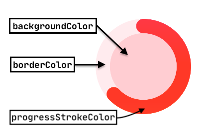

# Initial page

## 🙈 Gif-shots


## ​🌶 Want to use it in your project? Here's how to install:

[](https://android-arsenal.com/api?level=14)[ ](https://bintray.com/kishannareshpal/maven/circularprogressview/_latestVersion)

Add the library to the **dependencies { ... }** section of your **app** level `build.gradle` file:

```groovy
// Check the badge above to replace the version number :)
implementation 'com.kishannareshpal:circularprogressview:{version.number}'
```

## 🐌 Now, let's get started

### 🤡 Custom xml attributes for you!!

Add the view to your xml layout file.

```markup
<com.kishannareshpal.circularprogressview.CircularProgressView
        xmlns:cpv="http://schemas.android.com/apk/res-auto"
        android:id="@+id/progress"
        android:layout_width="48dp"
        android:layout_height="48dp"
        cpv:progressType="determinate"
        cpv:progressStrokeColor="@color/blue" />
```



<table>
  <thead>
    <tr>
      <th style="text-align:left"><b>XML Attributes</b>
      </th>
      <th style="text-align:left"><b>Description</b>
      </th>
      <th style="text-align:left"><b>Data Type</b>
      </th>
      <th style="text-align:left"><b>Possible Values</b>
      </th>
      <th style="text-align:left"><b>Default Value</b>
      </th>
      <th style="text-align:left"><b>Is Required?</b>
      </th>
    </tr>
  </thead>
  <tbody>
    <tr>
      <td style="text-align:left">progressType</td>
      <td style="text-align:left">
        <p><b>Determinate indicators</b> display how long a process will take. They
          should be used when the process completion rate can be detected.</p>
        <p></p>
        <p><b>Indeterminate indicators</b> express an unspecified amount of wait time.
          They should be used when progress isn&#x2019;t detectable, or if it&#x2019;s
          not necessary to indicate how long an activity will take.</p>
      </td>
      <td style="text-align:left">enum</td>
      <td style="text-align:left">
        <ul>
          <li><b>determinate</b>
          </li>
          <li><b>indeterminate</b>
          </li>
        </ul>
      </td>
      <td style="text-align:left"><b>indeterminate</b>
      </td>
      <td style="text-align:left">NO</td>
    </tr>
    <tr>
      <td style="text-align:left">progressStrokeColor</td>
      <td style="text-align:left">the color of the progress stroke indicator</td>
      <td style="text-align:left">color</td>
      <td style="text-align:left">n/a</td>
      <td style="text-align:left">#000000
        <br />(black)</td>
      <td style="text-align:left">NO</td>
    </tr>
    <tr>
      <td style="text-align:left">backgroundColor</td>
      <td style="text-align:left">the color between the stroke indicator</td>
      <td style="text-align:left">color</td>
      <td style="text-align:left">n/a</td>
      <td style="text-align:left">#FF000000
        <br />(transparent)</td>
      <td style="text-align:left">NO</td>
    </tr>
    <tr>
      <td style="text-align:left">borderColor</td>
      <td style="text-align:left">a light color used to highlight the stroke indicator path</td>
      <td style="text-align:left">color</td>
      <td style="text-align:left">n/a</td>
      <td style="text-align:left">#FF000000
        <br />(transparent)</td>
      <td style="text-align:left">NO</td>
    </tr>
    <tr>
      <td style="text-align:left">determinateProgressValue</td>
      <td style="text-align:left">sets the current progress value based on the provided <b>maxDeterminateProgressValue</b>*</td>
      <td
      style="text-align:left">float</td>
        <td style="text-align:left">n/a</td>
        <td style="text-align:left">n/a</td>
        <td style="text-align:left">NO</td>
    </tr>
    <tr>
      <td style="text-align:left">determinateProgressValuePercentage</td>
      <td style="text-align:left">sets the current progress value by percentage based on the provided <b>maxDeterminateProgressValue</b>*</td>
      <td
      style="text-align:left">float</td>
        <td style="text-align:left">n/a</td>
        <td style="text-align:left">n/a</td>
        <td style="text-align:left">NO</td>
    </tr>
    <tr>
      <td style="text-align:left">maxDeterminateProgressValue*</td>
      <td style="text-align:left">the maximum value of the progress indicator. Corresponds to 100%.</td>
      <td
      style="text-align:left">float</td>
        <td style="text-align:left">n/a</td>
        <td style="text-align:left">n/a</td>
        <td style="text-align:left">YES*</td>
    </tr>
    <tr>
      <td style="text-align:left">progressStrokePlacement</td>
      <td style="text-align:left">sets where the stroke indicator should be placed.</td>
      <td style="text-align:left">enum</td>
      <td style="text-align:left">
        <ul>
          <li>outside</li>
          <li>inside</li>
          <li>center</li>
        </ul>
      </td>
      <td style="text-align:left">inside</td>
      <td style="text-align:left">NO</td>
    </tr>
  </tbody>
</table>
\*It is required when you set either `determinateProgressValue` or `determinateProgressValuePercentage`.


### 🥢 Here is a list of all available methods.

<table>
  <thead>
    <tr>
      <th style="text-align:left"><b>Return type</b>
      </th>
      <th style="text-align:left"><b>Method &amp; Description</b>
      </th>
    </tr>
  </thead>
  <tbody>
    <tr>
      <td style="text-align:left">boolean</td>
      <td style="text-align:left">
        <p><b><code>isIndeterminate()</code></b>
        </p>
        <p>Returns whether the progress type is <b>ProgressType.INDETERMINATE</b>
        </p>
      </td>
    </tr>
    <tr>
      <td style="text-align:left">void</td>
      <td style="text-align:left">
        <p><b><code>setBackgroundColor(int colorInt)</code></b>
        </p>
        <p>Changes the current backgroundColor to the specified one.</p>
      </td>
    </tr>
    <tr>
      <td style="text-align:left">void</td>
      <td style="text-align:left">
        <p><b><code>setBorderColor(int colorInt)</code></b>
        </p>
        <p>Changes the current borderColor to the specified one.</p>
      </td>
    </tr>
    <tr>
      <td style="text-align:left">void</td>
      <td style="text-align:left">
        <p><b><code>setProgressStrokeColor(int colorInt)</code></b>
        </p>
        <p>Change the stroke color of the progress.</p>
      </td>
    </tr>
    <tr>
      <td style="text-align:left">void</td>
      <td style="text-align:left">
        <p><b><code>setStrokePlacement(StrokePlacement strokePlacement)</code></b>
        </p>
        <p>Change the stroke position to be either <b>StrokePlacement.OUTSIDE,</b>  <b>StrokePlacement.INSIDE</b> or <b>StrokePlacement.CENTER.</b>
        </p>
      </td>
    </tr>
    <tr>
      <td style="text-align:left">void</td>
      <td style="text-align:left">
        <p><b><code>setProgressType(ProgressType progressType)</code></b>
        </p>
        <p>Change the progress type to be either <b>ProgressType.DETERMINATE, ProgressType.INDETERMINATE.</b>
        </p>
      </td>
    </tr>
    <tr>
      <td style="text-align:left">void</td>
      <td style="text-align:left">
        <p><b><code>pauseIndeterminateAnimation(boolean hideStroke)</code></b>
        </p>
        <p>Pauses the indeterminate stroke animation to the current position. If <b>hideStroke is true</b> it
          will hide the stroke automatically when paused.</p>
        <p></p>
        <p><b><code>resumeIndeterminateAnimation()</code></b>
        </p>
        <p>Resumes the paused indeterminate stroke animation.</p>
        <p></p>
        <p><b><code>toggleIndeterminateAnimation()</code></b>
        </p>
        <p>Toggles the indeterminate animation.</p>
      </td>
    </tr>
    <tr>
      <td style="text-align:left">void</td>
      <td style="text-align:left">
        <p><b><code>pauseIndeterminateAnimation()</code></b>
        </p>
        <p>Resumes the paused indeterminate stroke animation.</p>
      </td>
    </tr>
    <tr>
      <td style="text-align:left">void</td>
      <td style="text-align:left">
        <p><b><code>setRange(int maximumProgressValue)</code></b>
        </p>
        <p>Sets the maximum allowed progress value. Should be &gt; 0</p>
      </td>
    </tr>
    <tr>
      <td style="text-align:left">void</td>
      <td style="text-align:left">
        <p><b><code>setProgress(float progressPercentage, boolean animated)</code></b>
        </p>
        <p>Sets the current progress value by the percentage. If <b>animated is true</b> it
          will animate the progress change.</p>
        <p></p>
        <p><b><code>setProgress(float progressPercentage)</code></b>
        </p>
        <p>Sets the current progress value by the percentage, without animating the
          change.</p>
        <p></p>
        <p>&#x1F4A1; Use this static method<b><code>(float) calcProgressValuePercentageOf(int value, int maxValue)</code></b>to
          get the progressPercentage.</p>
      </td>
    </tr>
  </tbody>
</table>

### 🏃🏾‍♂️ Lets see it in action

```java
CircularProgressView cpv = findViewById(R.id.cpv);
```

```java
// You can color the background, the stroke and the border.
// Multiple colors for gradient.
int[] gradientColors = new int[] {
    Color.parseColor("#ff9100"), // orange
    Color.parseColor("#ff1744") // red
};

cpv.setBackgroundColor(Color.parseColor("#ffcdd2")); // light red
cpv.setBorderColor(Color.parseColor("#ffebee")); // lighter red
cpv.setProgressStrokeColor(gradientColors); // a gradient of red and orange

// Or pass just a single color for a solid progressStrokeColor.
/* cpv.setProgressStrokeColor(Color.parseColor("#ff1744")); */
```


```java
// For choosing where the progressStroke is placed with:
cpv.setStrokePlacement(StrokePlacement.OUTSIDE);
/* cpv.setStrokePlacement(StrokePlacement.CENTER); */
/* cpv.setStrokePlacement(StrokePlacement.INSIDE); */
```


```java
// Lets suppose you are downloading a file, and you want to show a progress:
cpv.setProgressType(ProgressType.DETERMINATE)

int totalBytes = 349022; // the maximum value of the progress
cpv.setRange(totalBytes);

// Update the progress using:
cpv.setProgress(10.0f, true) // 10% of the maximum value of the progress.

// Or if you want to update the progress using a value out of the total.
int downloadedBytes = 1230; // downloaded 1230 bytes out of the total of 349022;
int p = CircularProgressView.calcProgressValuePercentageOf(downloadedBytes, totalBytes)
cpv.setProgress(p, true);
```


